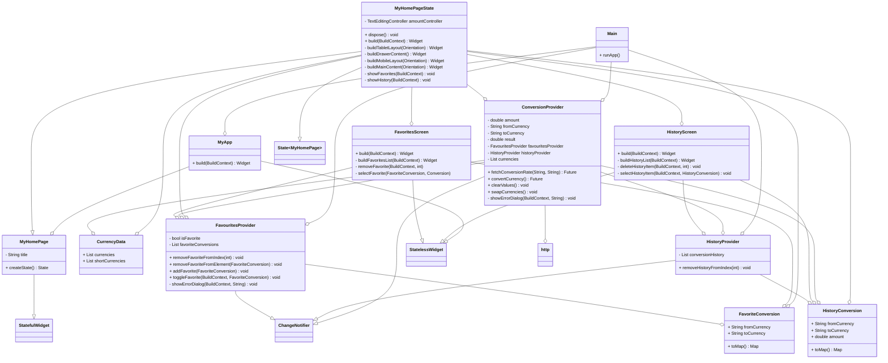

# Diseño software

>!-- ## Notas para el desarrollo de este documento
>En este fichero debeis documentar el diseño software de la práctica.

 >:warning: El diseño en un elemento "vivo". No olvideis actualizarlo
 >a medida que cambia durante la realización de la práctica.

 >:warning: Recordad que el diseño debe separar _vista_ y
 >_estado/modelo_.
	 

>El lenguaje de modelado es UML y debeis usar Mermaid para incluir los
diagramas dentro de este documento. Por ejemplo:

>Diagrama de secuencia que contiene los casos de uso de listar divisas, convertir divisas, añadir al historial, añadir a favoritos, limpiar campos y eliminar favorito

>Diagrama de secuencia que contiene los casos de uso de listar divisas y convertir divisas

>Diagrama de secuencia que contiene los casos de uso de listar divisas y convertir divisas

>Diagrama de secuencia que contiene los casos de uso de listar divisas y convertir divisas

>Diagrama de secuencia que contiene los casos de uso de listar divisas y convertir divisas

>Diagrama de secuencia que contiene los casos de uso de listar divisas y convertir divisas

>Diagrama de secuencia que contiene los casos de uso de listar divisas y convertir divisas

>Diagrama de secuencia que contiene los casos de uso de listar divisas y convertir divisas

>Diagrama de secuencia que contiene los casos de uso de listar divisas y añadir a favoritos

>Diagrama de secuencia que contiene los casos de uso de listar divisas, convertir divisas, añadir al historial y eliminar del historial

